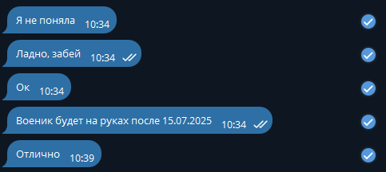
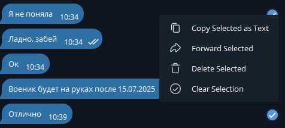

# Анонимные сообщения
## Суть проекта
### Данный проект позволяет пересылать сообщения, при этом не создавая треугольные отношения.
## Установка
### Клонирование приложения:
```
git clone https://github.com/KlimentFis/Deperson_messages.git && cd Deperson_messages
```
### Установка виртуального окружения:
```
### python -m venv venv
```
### Установка зависимостей:
```
pip install tkinter
```
## Использование
### Находим нужные сообщения:

### Выделяем и нажимаем на 'Copy Selected as Text':

### Вставляем в блокнот:
```
Мама 😑😑😑, [19.05.2025 10:34]
Я не поняла

KlimentFis, [19.05.2025 10:34]
Ладно, забей

Мама 😑😑😑, [19.05.2025 10:34]
Ок

KlimentFis, [19.05.2025 10:34]
Военик будет на руках после 15.07.2025

Мама 😑😑😑, [19.05.2025 10:39]
Отлично
```
### Запускаем скрипт:
```
python main.py
```
### Получаем результат:
```
- Я не поняла
- Ладно, забей
- Ок
- Военик будет на руках после 15.07.2025
- Отлично
```